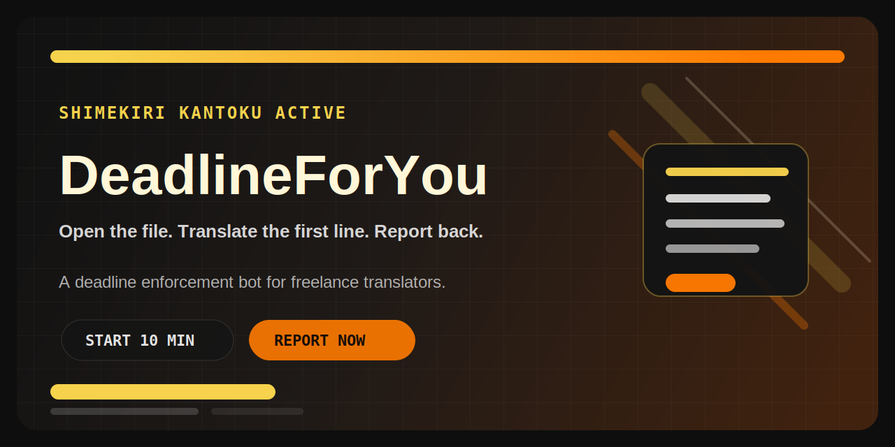

# DeadlineForYou

`DeadlineForYou`는 프리랜서 번역가를 다시 작업 화면으로 밀어 넣는 로컬 마감 집행 시스템이다.  
핵심 캐릭터는 마감 집행관 `締切監督`이고, 목표는 위로가 아니라 `즉시 착수`다.

현재 구현 범위:

- FastAPI 백엔드
- Telegram bot 어댑터
- SQLite 저장소
- 로컬 코칭 모델
- 로컬 번역 모델
- 로컬 이미지 생성 모델
- 내부 tool calling 루프
- 파일 단위 작업 추적
- 자동 작업량 계산
- 마감 역산 플래너
- 자동 체크인 리마인더
- 텍스트 파일 업로드 후 번역 보조

## 구성 요약

- 코칭 모델: `deadlineforyou/models/saya_rp_4b_v3`
- 대체 코칭 모델: `deadlineforyou/models/qwen3_4b_instruct`
- 번역 모델: `deadlineforyou/models/rosetta_4b`
- 이미지 모델: `deadlineforyou/models/sdxl_turbo`
- 테스트 fallback: `scripted`

기본 구조:

```text
User
 ├─ Swagger UI / REST Client
 └─ Telegram Chat
         |
         v
  FastAPI / Telegram Adapter
         |
         v
  DeadlineCoachService
         |
         +─ Prompt Builder
         +─ Local Coach Provider
         +─ Local Translation Provider
         +─ Local Image Provider
         +─ SQLite Storage
```

## 시연 영상

- [프로젝트 매니징 봇 시연 영상](https://drive.google.com/file/d/1pk-bsX8rcif5vmnr_pne6grP-qsJ75ns/view?usp=sharing)


## 설치

```bash
cd /home/hosung/pytorch-demo/DeadlineForYou
uv venv
source .venv/bin/activate
uv pip install -e .
cp .env.example .env
```

모델이 아직 없으면 먼저 받는다.

```bash
uv run initialize.py
uv run initialize.py --target image
```

`initialize.py` 기본 동작:

- `coach`: `Qwen/Qwen3-4B-Instruct-2507`
- `translation`: `yanolja/YanoljaNEXT-Rosetta-4B`

이미지 모델:

- `image`: `stabilityai/sdxl-turbo`

## 실행

API 서버:

```bash
uv run uvicorn deadlineforyou.main:app --reload
```

접속 주소:

- Swagger UI: `http://127.0.0.1:8000/docs`
- ReDoc: `http://127.0.0.1:8000/redoc`

Telegram bot:

`.env`에 토큰을 넣는다.

```env
DFY_TELEGRAM_BOT_TOKEN=123456:ABC...
```

실행:

```bash
uv run python -m deadlineforyou.telegram_bot
```

주의:

- API와 Telegram bot은 각각 단독 실행 가능하다.
- 둘 다 같은 SQLite 파일을 공유한다.
- 이미지 생성까지 같이 쓰면 GPU 메모리가 빠듯할 수 있다.

## 환경 변수

기본 핵심 설정:

```env
DFY_DATABASE_PATH=data/deadlineforyou.db

DFY_LLM_PROVIDER=local
DFY_LOCAL_MODEL_PATH=deadlineforyou/models/saya_rp_4b_v3
DFY_LOCAL_DEVICE_MAP=auto
DFY_LOCAL_MAX_NEW_TOKENS=220
DFY_LOCAL_TEMPERATURE=0.7

DFY_TRANSLATION_PROVIDER=local
DFY_TRANSLATION_LOCAL_MODEL_PATH=deadlineforyou/models/rosetta_4b
DFY_TRANSLATION_LAZY_LOAD=true
DFY_TRANSLATION_LOCAL_MAX_NEW_TOKENS=256
DFY_TRANSLATION_LOCAL_TEMPERATURE=0.2

DFY_IMAGE_PROVIDER=local
DFY_IMAGE_LOCAL_MODEL_PATH=deadlineforyou/models/sdxl_turbo
DFY_IMAGE_LAZY_LOAD=true
DFY_IMAGE_UNLOAD_AFTER_GENERATION=true
DFY_IMAGE_ENABLE_MODEL_CPU_OFFLOAD=true
DFY_IMAGE_RELEASE_TRANSLATION_BEFORE_GENERATION=true
DFY_IMAGE_DEVICE=cuda
DFY_IMAGE_NUM_INFERENCE_STEPS=4
DFY_IMAGE_GUIDANCE_SCALE=0.0
DFY_IMAGE_OUTPUT_DIR=data/generated_images
```

지원 provider:

- 코칭: `local`, `scripted`
- 번역: `local`, `scripted`, `inherit`
- 이미지: `local`, `none`

## 시스템이 어떻게 동작하는가

기본 흐름:

1. 사용자 메시지를 받는다.
2. 현재 활성 프로젝트를 찾는다.
3. 프로젝트 파일과 남은 분량을 확인한다.
4. 최근 대화, 프로젝트 상태, 권장 타이머, 플래너 요약을 프롬프트에 넣는다.
5. `締切監督`가 답변을 생성한다.
6. 필요하면 내부 tool을 호출해 번역, 이미지 생성, 세션 처리, 프로젝트 조회를 수행한다.

즉 이 시스템은 `대화 + 프로젝트 상태 + 파일 상태 + 작업 지시 + 기록`을 한 번에 묶어 둔 구조다.

## 처음 쓰는 사람용 빠른 시작

텔레그램에서 가장 먼저 할 일은 이 네 줄이다.

1. 프로젝트 등록

```text
게임 시나리오 번역 | jp | ko | auto | 2026-03-14 18:00 | 문장
```

2. 상태 확인

```text
/status
```

프로젝트를 여러 개 등록했다면:

```text
/deadline_list
/deadline_switch 3
```

즉, 목록에서 ID를 보고 원하는 프로젝트를 활성으로 바꾸면 된다.

프로젝트 정보를 고치고 싶다면:

```text
/deadline_update 3 | 게임 시나리오 번역 수정본 | jp | ko | auto | 2026-03-15 18:00 | 문장
```

프로젝트를 지우고 싶다면:

```text
/deadline_delete 3
```

삭제하면 연결된 파일, 세션, 메시지도 같이 지워진다.

3. 작업 시작

```text
/timer 25
```

4. 세션 끝나면 완료량 보고

```text
/report 12
```

이 네 개만 이해하면 기본 사용은 끝이다.

## 텔레그램에서 실제로 어떻게 쓰는가

### 1. 프로젝트 등록

아래 형식으로 한 줄만 보내면 된다.

```text
제목 | 원문언어 | 목표언어 | 총량 | 마감시각 | 단위
```

예:

```text
게임 시나리오 번역 | jp | ko | auto | 2026-03-14 18:00 | 문장
```

뜻:

- `게임 시나리오 번역`: 프로젝트 이름
- `jp`: 원문 언어
- `ko`: 목표 언어
- `auto`: 아직 총량을 모른다는 뜻
- `2026-03-14 18:00`: 최종 마감 시각
- `문장`: 작업 단위

주의:

- 여기 들어가는 시간은 `/timer` 시간이 아니라 `프로젝트 마감 시간`이다.
- 총량을 알고 있으면 `120`처럼 숫자로 넣어도 된다.
- 총량을 모르면 `auto`로 두고 파일을 올리면 자동 집계로 다시 계산된다.

### 2. 상태 확인

```text
/status
```

여기서 보이는 것:

- 현재 활성 프로젝트
- 현재 진행률
- 남은 파일 수
- 밀린 파일 수
- 자동 집계된 세그먼트/글자 수
- 하루 최소 몇 단위 해야 하는지
- 오늘 집중 시간
- 파일 ID와 파일명

### 3. 파일 업로드

활성 프로젝트가 있으면 `.txt` 파일을 그냥 텔레그램에 올리면 된다.

업로드하면 시스템이 바로:

- 파일을 프로젝트 파일로 등록하고
- 글자 수, 줄 수, 세그먼트 수를 계산하고
- 파일 ID를 알려주고
- 프로젝트 총량과 완료량도 파일 기준으로 다시 맞춘다.

### 4. 타이머 시작

```text
/timer 25
```

의미:

- 지금부터 25분 동안 일하겠다는 뜻
- 10분 이상이면 중간에 압박 메시지가 온다.
- 끝나면 `/report <숫자>`로 완료량을 보내야 한다.

### 5. 완료량 보고

```text
/report 12
```

의미:

- 이번 세션에서 12단위를 끝냈다는 뜻
- 단위는 프로젝트 등록 때 넣은 `문장`, `페이지`, `줄` 같은 값이다.

주의:

- 숫자가 없으면 반영되지 않는다.
- 보고를 안 하면 세션은 `0`으로 자동 마감된다.
- 자동 마감 뒤에는 새 `/timer`를 시작하라고 다시 재촉한다.

### 6. 번역과 이미지 생성

직접 명령 번역:

```text
/translate jp | en | 締切は明日の18時です。
```

직접 명령 이미지:

```text
/image happy hamster, clean illustration
```

파일 번역 보조:

```text
/file_assist 3 | jp | ko
```

일반 말로도 된다.

예:

```text
일본어를 영어로 번역해줘.
今は忙しいの。
```

```text
아래 이미지를 생성해줘.

happy hamster
```

이 경우에는 일반 챗으로 들어가고, LLM이 tool calling으로 번역/이미지 도구를 쓸지 스스로 판단한다.

## 핵심 사용 흐름

가장 기본적인 사용 순서는 이렇다.

1. 프로젝트 등록
2. 필요하면 프로젝트 파일 업로드
3. `/status`로 현재 상태 확인
4. `/timer <분>`으로 작업 세션 시작
5. 세션 도중 10분마다 압박 메시지 수신
6. 세션 종료 후 `/report <작업량>`으로 완료 보고
7. 필요하면 `/translate`, `/image`, `/file_assist` 사용

## 프로젝트 등록

프로젝트 등록은 두 방식 모두 가능하다.

- 명령으로 등록: `/deadline_add 게임 시나리오 번역 | jp | ko | 120 | 2026-03-14 18:00 | 문장`
- 줄만 보내서 등록: `게임 시나리오 번역 | jp | ko | 120 | 2026-03-14 18:00 | 문장`
- 총량을 아직 모르겠으면: `게임 시나리오 번역 | jp | ko | auto | 2026-03-14 18:00 | 문장`

지원 언어 코드는 `ko`, `jp`, `en`, `ch`만 받는다.  
`ja`는 `jp`, `zh`와 `cn`은 `ch`로 자동 정규화한다.

항목 뜻:

- `게임 시나리오 번역`: 프로젝트 제목
- `jp`: 원문 언어
- `ko`: 목표 언어
- `120` 또는 `auto`: 프로젝트 전체 분량
- `2026-03-14 18:00`: 프로젝트 최종 마감 시각
- `문장`: 분량 단위

즉 여기 들어가는 시간은 `/timer` 시간이 아니라 `프로젝트 마감 시간`이다.

`auto`를 쓰면 파일 업로드 후 자동 집계가 총량을 다시 잡는다.

## 파일 기반 작업 추적

프로젝트에는 여러 파일을 붙일 수 있다.

파일마다 저장하는 것:

- 파일명
- 원문 텍스트
- 번역 텍스트
- 원문 글자 수 / 줄 수 / 세그먼트 수
- 번역 글자 수 / 줄 수 / 세그먼트 수
- 파일 상태
- 파일별 마감

자동 계산되는 것:

- 전체 파일 수
- 남은 파일 수
- 밀린 파일 수
- 전체 글자 수
- 전체 세그먼트 수
- 번역 완료 글자 수
- 번역 완료 세그먼트 수

이 값은 `/status`, `/deadline_list`, API overview, planner에 같이 반영된다.

## 타이머와 보고 구조

수동 세션은 `/timer <분>` 하나만 쓴다.

예:

- `/timer 10`
- `/timer 25`
- `/timer 45`

동작:

1. 지정한 분 수로 세션 생성
2. 세션이 10분 이상이면 10분마다 압박 메시지 전송
3. 세션 종료 시 `/report <작업량>` 보고 요청
4. 사용자가 제때 보고하지 않으면 세션을 `AUTO_REPORT_0`으로 자동 마감
5. 자동 마감 뒤에는 새 `/timer <분>` 을 다시 시작하라고 재촉
6. 사용자가 제때 `/report`를 보내면 완료량이 프로젝트에 반영되고 다음 지시가 생성됨

`/report` 숫자 뜻:

- `/report 8`이면 이번 세션에서 `8단위`를 끝냈다는 뜻이다.
- 단위는 프로젝트 등록 때 넣은 `문장`, `페이지`, `줄` 같은 단위다.
- 숫자가 없으면 완료 보고로 처리하지 않는다.

현재 리마인더 구조:

- 10분 진행 압박
- 세션 종료 시 보고 요청
- 미보고 시 자동 0마감
- 자동 마감 후 재시작 재촉
- 오전/오후/밤 특정 시간대 자동 체크인 푸시

## 마감 역산 플래너

플래너는 활성 프로젝트 기준으로 아래를 계산한다.

- 남은 단위 수
- 남은 일수
- 하루 최소 필요 작업량
- 시간당 최소 필요 작업량
- 남은 파일 수
- 밀린 파일 수

예시 해석:

- `남은 120문장, 약 2.5일`
- `하루 최소 48문장 필요`

즉 단순 남은 양만 보여주는 게 아니라, 지금 페이스가 얼마나 필요한지 같이 보여준다.

## 코칭 모델은 언제 호출되는가

코칭 모델은 아래 경우에만 호출된다.

- 일반 텔레그램 대화
- API `POST /chat`
- 10분 진행 알림
- 세션 종료 후 자동 0마감 이후 재시작 재촉
- 특정 시간대 자동 체크인
- `/report` 후 다음 지시 생성

반대로 코칭 모델을 쓰지 않는 곳:

- `/timer` 시작 확인
- `/status`
- `/deadline_add`, `/deadline_list`
- `/translate`
- `/image`
- `/file_assist`

## 번역과 이미지 생성

직접 명령:

- Telegram: `/translate <원문언어> | <목표언어> | <원문>`
- Telegram: `/image <프롬프트>`
- Telegram: `/file_assist <파일ID> | <원문언어> | <목표언어>`
- API: `POST /translate`
- API: `POST /images/generate`
- API: `POST /project-files/{file_id}/assist-translation`

일반 텍스트 대화에서는 사용자가 자연어로 번역이나 이미지 생성을 요청해도 된다.  
이 경우 판단은 텔레그램 정규식이 아니라 `LLM tool calling`이 맡는다.

현재 모델 분리:

- 코칭: `Qwen3-4B-Instruct-2507`
- 번역: `rosetta_4b`
- 이미지: `sdxl_turbo`

이미지 요청은 실제 이미지 파일을 텔레그램에 업로드한다.  
파일 경로 텍스트를 사용자에게 보여주지 않는다.

## 파일 업로드 후 번역 보조

텔레그램:

- 활성 프로젝트가 있는 상태에서 `.txt` 파일을 그냥 올리면 된다.
- 시스템이 파일을 프로젝트 파일로 등록한다.
- 업로드 직후 파일 ID와 자동 집계 결과를 알려준다.
- 이어서 `/file_assist <파일ID> | <원문언어> | <목표언어>` 로 파일 앞부분 최대 `1500자` 번역 초안을 받을 수 있다.
- 결과는 긴 채팅 텍스트가 아니라 `.txt` 파일로 돌려준다.

API:

- `POST /project-files`
- `GET /projects/{project_id}/files`
- `PATCH /project-files/{file_id}`
- `POST /project-files/{file_id}/assist-translation`

## API 실험 순서

Swagger UI에서 보통 이 순서로 확인하면 된다.

1. `POST /users`
2. `POST /projects`
3. `POST /project-files`
4. `GET /projects/{project_id}/overview`
5. `GET /projects/{project_id}/planner`
6. `POST /chat`
7. `POST /sessions`
8. `POST /sessions/{session_id}/complete`
9. `GET /users/{user_id}/daily-report`

예시 요청:

`POST /projects`

```json
{
  "user_id": 1,
  "title": "게임 시나리오 번역",
  "source_language": "jp",
  "target_language": "ko",
  "total_units": 120,
  "completed_units": 0,
  "deadline_at": "2026-03-14T18:00:00+09:00",
  "unit_label": "문장"
}
```

`POST /project-files`

```json
{
  "project_id": 1,
  "name": "scene01.txt",
  "source_text": "締切は明日の18時です。\n今は忙しいの。",
  "translated_text": ""
}
```

`GET /projects/1/overview`

- 파일 수
- 남은 파일 수
- 밀린 파일 수
- 자동 집계된 세그먼트/글자 수
- 플래너 요약

`GET /projects/1/planner`

- 남은 단위
- 남은 일수
- 하루 최소 필요 작업량
- 시간당 최소 필요 작업량

## 텔레그램 사용 요약

하단 버튼:

- `프로젝트 등록 양식`
- `프로젝트 수정 양식`
- `프로젝트 삭제 양식`
- `프로젝트 목록`
- `프로젝트 전환 양식`
- `현재 상태`
- `타이머 시작 양식`
- `작업 보고 안내`
- `번역 양식`
- `이미지 양식`
- `파일 번역 보조 양식`
- `도움말`

입력 예시:

- `프로젝트 등록 양식` -> `게임 시나리오 번역 | jp | ko | auto | 2026-03-14 18:00 | 문장`
- `프로젝트 수정 양식` -> `/deadline_update 3 | 게임 시나리오 번역 수정본 | jp | ko | auto | 2026-03-15 18:00 | 문장`
- `프로젝트 삭제 양식` -> `/deadline_delete 3`
- `프로젝트 목록` -> 현재 프로젝트 ID/상태 확인
- `프로젝트 전환 양식` -> `/deadline_switch 3`
- `현재 상태` -> 활성 프로젝트 상태 확인
- `타이머 시작 양식` -> `/timer 25`
- `작업 보고 안내` -> `/report 12`
- `번역 양식` -> `/translate jp | en | 締切は明日の18時です。`
- `이미지 양식` -> `/image deadline enforcer poster, black and orange warning stripes`
- `파일 번역 보조 양식` -> `/file_assist 3 | jp | ko`
- 파일 업로드 -> 활성 프로젝트가 있으면 `.txt` 파일 그대로 전송

체크 포인트:

- 자연어 번역 요청이면 코칭으로 새지 않고 번역 결과만 나오는지
- 자연어 이미지 요청이면 실제 이미지만 올라오는지
- `.txt` 파일을 올렸을 때 파일 ID와 자동 집계가 보이는지
- `/status`에서 남은 파일 수와 플래너 요약이 보이는지

## 현재 구현

- 지금은 `로컬-only` 구조다.
- 코칭, 번역, 이미지 생성은 각자 모델을 따로 쓴다.
- 텔레그램 일반 대화는 `tool calling`으로 번역/이미지 요청을 처리할 수 있다.
- 프로젝트는 숫자만이 아니라 파일 단위로도 관리된다.
- 자동 집계와 플래너가 `status/list/API`에 같이 붙어 있다.

## 추후 작업

- 글자수/단어수 단위로 프로젝트 관리
- 파일 기반 작업 보고 기능 추가
- UX 개선
